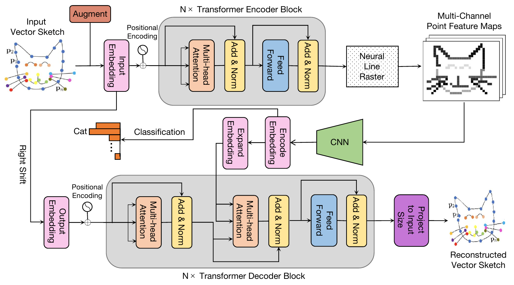

# Trans2CNN

This repo contains the code of our project: 

**Trans2CNN: A Transformer-Rasterization-CNN Architecture for Freehand Sketch Recognition [*CS420 Machine Learning Project*]**

[Zenan Li](https://github.com/Emiyalzn), [Qi Liu](https://github.com/Purewhite2019)

[[`Paper`](https://github.com/Emiyalzn/CS420-Sketch-Recognition/blob/main/project_report.pdf)] [[`Model Checkpoint`](https://drive.google.com/drive/folders/1frGandm0SpVK9wcgmEk1bfdpFyapPMgs?usp=sharing)]



## TODO

- [x] Provide pretrained model
- [x] Provide project report

## Installation instructions

```bash
# 1. Create a conda virtual environment.
conda create -n trans2cnn python=3.8 -y
conda activate trans2cnn

# 2. Install PyTorch
conda install pytorch torchvision torchaudio cudatoolkit=11.3 -c pytorch

# 3. Pull our code
git clone https://github.com/Emiyalzn/CS420-Sketch-Recognition
cd HybrIK

# 4. Install
pip install -r requirements.txt
```

## Train from scratch

```bash
CUDA_HOME=/usr/local/cuda-11.1/ CUDA_VISIBLE_DEVICES=2 python train.py --data_seq_dir {...} --batch_size {...} --lr {...} --do_reconstruction
```

```python
from run.X_runner import XRunner
with XRunner() as app:
    with warnings.catch_warnings():
        warnings.simplefilter('ignore')
        app.train()
```

## Evaluation

```python
from run.X_runner import XRunner
with XRunner(local_dir='...') as app:
    with warnings.catch_warnings():
        warnings.simplefilter('ignore')
        app.evaluate()
```

## Visualization

```python
from run.X_runner import XRunner
with XRunner(local_dir='...') as app:
    with warnings.catch_warnings():
        warnings.simplefilter('ignore')
        app.visualize_emb()
```

## Perform Robustness Experiment

```python
stroke_removal_probs = [...]
stroke_deformation_settings = [...]

from run.X_runner import XRunner
with XRunner(local_dir='...') as app:
    with warnings.catch_warnings():
        warnings.simplefilter('ignore')
        app.robustness_experiment(
            stroke_removal_probs=stroke_removal_probs,
            stroke_deformation_settings=stroke_deformation_settings)
```

## Perform Human Experiment

```bash
python ./human_experiment.py
```

## Results

### Main Results

| Model            | Top-1 Accuracy$\uparrow$ | Top-5 Accuracy$\uparrow$ | Precision$\uparrow$ | Recall$\uparrow$  | F1 Score$\uparrow$ |
| ---------------- | ------------------------ | ------------------------ | ------------------- | ----------------- | ------------------ |
| SketchGRU        | 0.8673±0.0034            | 0.9795±0.0028            | 0.8688±0.0031       | 0.8673±0.0034     | 0.8677±0.0033      |
| SketchLSTM       | 0.8583±0.0030            | 0.9778±0.0027            | 0.8571±0.0032       | 0.8583±0.0030     | 0.8573±0.0031      |
| Sketch-a-Net     | 0.8314±0.0025            | 0.9690±0.0023            | 0.8299±0.0027       | 0.8314±0.0025     | 0.8299±0.0027      |
| ResNet50         | 0.8672±0.0020            | 0.9792±0.0020            | 0.8675±0.0022       | 0.8673±0.0020     | 0.8669±0.0021      |
| EfficientNet     | 0.8718±0.0022            | 0.9807±0.0022            | 0.8714±0.0027       | 0.8718±0.0022     | 0.8714±0.0024      |
| SketchMate       | 0.8729±0.0029            | 0.9827±0.0022            | 0.8730±0.0040       | 0.8730±0.0029     | 0.8726±0.0034      |
| Sketch-R2CNN     | 0.8751±0.0025            | 0.9811±0.0024            | 0.8752±0.0020       | 0.8750±0.0026     | 0.8747±0.0021      |
| Human Test       | 0.8237±0.0876            | /                        | 0.8311±0.1045       | 0.8260±0.1475     | 0.8187±0.1015      |
| Trans2CNN (ours) | **0.8839±0.0020**        | **0.9837±0.0017**        | **0.8836±0.0022**   | **0.8839±0.0024** | **0.8834±0.0018**  |

### Robustness


### t-SNE Visualization


